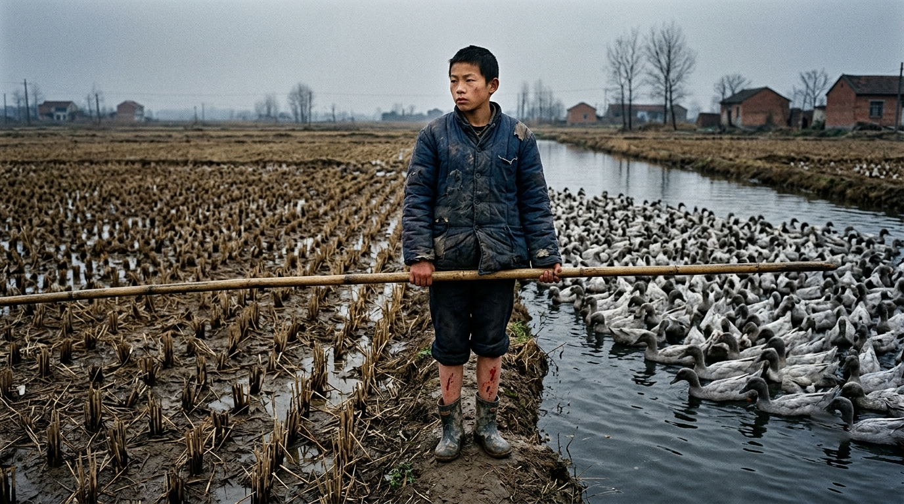

  <a href="./README-zh-Hant.md">繁體中文</a>

# 底层重构

## Life is a legacy system that requires constant refactoring.

> 人生和软件系统其实很像。
> 都会积累技术债，都会经历失控，也都需要不断重构。

《底层重构》是一部持续连载的，真实人生回忆录，写的是一个被三百块钱赶出学校的少年，后来如何一步一步把自己的人生重新搭起来。

这里没有成功学，也没有技术鸡汤。这里只有辍学、放鸭、抓鳝鱼、学手艺、进城、写代码，和一个从湖北洪湖农村走出来的人，如何在一次次失控之后，把自己从旧系统里慢慢重构出来的真实过程。

👉 [关于作者](./ABOUT.md)

### 连载目录

👉 [阅读 第01章：《我被三百块钱赶出了学校》](./chapters/01-kicked-out-for-300.md)

👉 [阅读 第02章：《实验班名单上，没有我的名字》](./chapters/02-experimental-class-list.md)

👉 [阅读 第03章：《四百只鸭子与田埂上的歌》](./chapters/03-four-hundred-ducks.md)

👉 [阅读 第04章：《四星村的鳝鱼》](./chapters/04-sixing-village-eels.md)

👉 [阅读 第05章：《爷爷的鸭棚》](./chapters/05-grandpas-duck-shed.md)

👉 [阅读 第06章：《千禧年，第一次进城的少年》](./chapters/06-millennium-first-trip-to-city.md)

👉 [阅读 第07章：《出租屋里的火气》](./chapters/07-rental-room-anger.md)

👉 [阅读 第08章：《黑兮兮的修理槽》](./chapters/08-repair-pit.md)

👉 [阅读 第09章：《第一次大修》](./chapters/09-first-overhaul.md)

👉 [阅读 第10章：《驾驶室里的卧铺》](./chapters/10-drivers-berth.md)

👉 [阅读 第11章：《过年之前》](./chapters/11-before-new-year.md)

👉 [阅读 第12章：《点亮了》（预告）](./chapters/12-lit-up.md)

### 番外篇

👉 [为了省点 Claude Code 钱，研究到了凌晨 3 点](./blog/too-poor-for-claude-code.md)

### 为什么写《底层重构》

人生和软件系统其实很像。都会积累技术债，都会经历失控，也都需要不断重构。

把这些经历写下来，既是对自己的交代，也是想把那些走过的弯路、吃过的苦、重新站起来的过程，留给后来的人看一看。

# 题外话

如果《底层重构》让你有所共鸣，欢迎点个 Star，这是我继续写下去的动力。

---

---

**Still building.**

**Still learning.**

**Still refactoring.**

